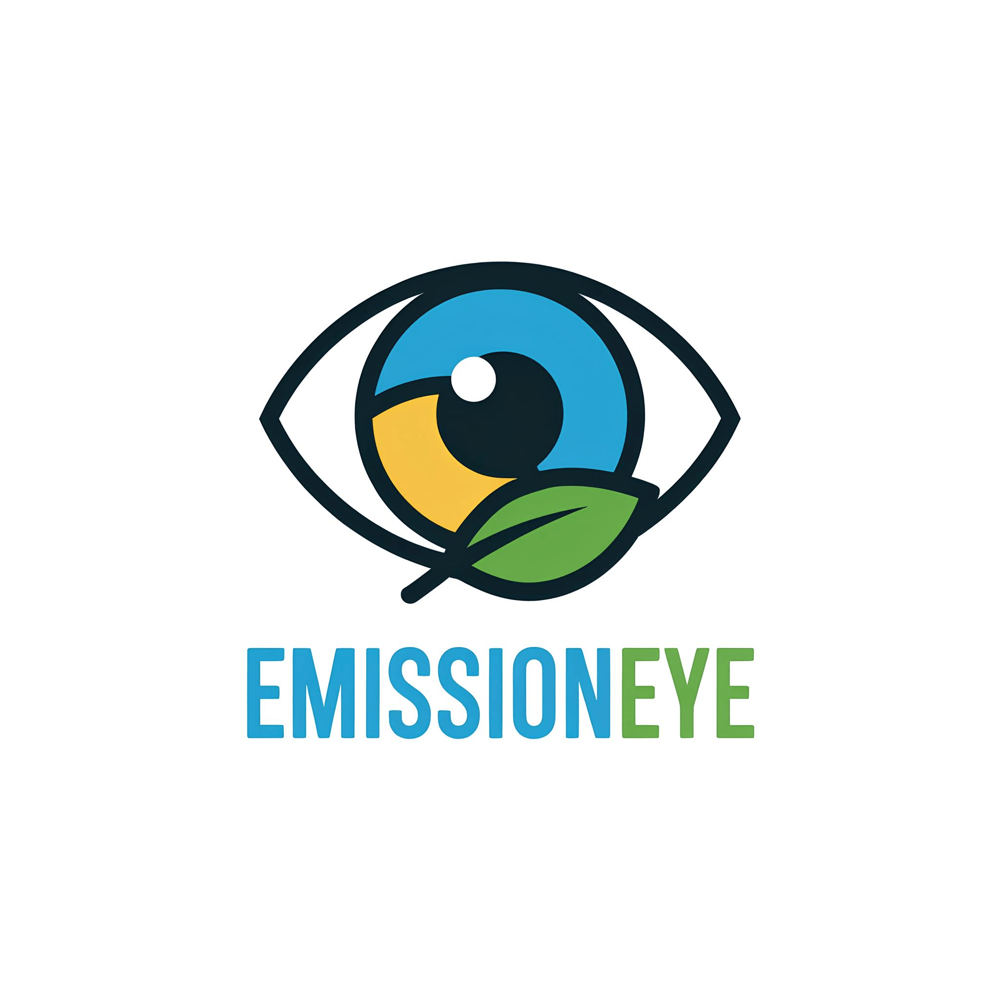

# EmissionEye
**EmissionEye** — прогнозирование рассеивания промышленных выбросов вредных веществ в городской среде с учетом парковых / лесных зон, метеофакторов и рельефа.

# Возможности
- ## Бэкенд на FastAPI:
	Использует простоту и производительность FastAPI для создания надежного слоя API с поддержкой асинхронного программирования.
- ## Фронтенд на Vue.js 
	Использует Vue.js для создания динамичного и отзывчивого пользовательского интерфейса, который плавно взаимодействует с бэкендом на FastAPI.

# Как пользоваться?
- ## Настройка переменнных окружения 
	1.Создайте файл с переменными окружения `cp .env.example .env` \
	2. Откройте файл .env в любом удобном для Вас текстовом редакторе. \
    3. Заполните нужные параметры

- ## Запуск
	- ### Backend
		1. [Установите poetry](https://python-poetry.org/docs/)
		2. Перейдите в каталог `backend` с помощью команды `cd backend`
		3. Выполните установку зависимостей `poetry install`
		4. Запустите бекенд `poetry run app`

	- ### Frontend
		1. Перейдите в каталог `frontend` с помощью команды `cd frontend`
		2. Установите зависимости `npm install`
        3. Запустите фронтенд `npm run serve`

# Вклад в развитие
Вклад в развитие EmissionEye приветствуется! \
Если вы обнаружите какие-либо проблемы или у вас есть идеи по улучшению, не стесняйтесь открывать проблему или отправлять запрос на слияние.

# Лицензия
EmissionEye распространяется под лицензией MIT. \
Подробнее смотрите в файле [LICENSE](LICENSE).